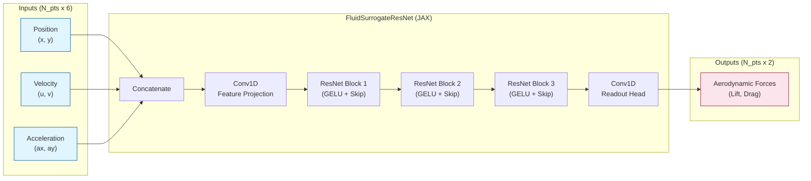

# Bio-Fluid Surrogate: Hybrid Physics-ML Aerodynamics


*Side-by-side validation on unseen kinematic data. **Left:** Real-time fluid vorticity field (Background) with instantaneous force vectors (Green=Ground Truth, Pink=Prediction). **Right:** Time-history of Lift and Drag forces showing the surrogate model tracking the CFD solver with high fidelity.*

**Bio-Fluid Surrogate** is a high-fidelity simulation framework that bridges the gap between accurate fluid dynamics and fast neural inference. It utilizes **Taichi** to run a Lattice Boltzmann Method (LBM) fluid simulation and **JAX** to train a real-time neural surrogate model on the generated data.

### 🌟 Key Features

* **Unified GPU Pipeline:** Efficient synchronization between **LBM** (Taichi) and **Differentiable Learning** (JAX).
* **Bio-Fluid Physics:** **D2Q9 LBM** solver with **Smagorinsky LES** for unsteady vortex dynamics at low-to-moderate Re.
* **Robust FSI:** **Brinkman Penalization** immersed boundary method for mapping Lagrangian structures to Eulerian grids.
* **Infinite Data Pipeline:** **Online learning** architecture generates physics data on-the-fly, eliminating static dataset constraints.
* **Geometric Invariance:** Decouples global body jitter from local wing kinematics, enabling efficient learning of **position-independent** aerodynamics.
* **Ghost Coupling:** Stabilizes training via a compliant spring-damper link between the control target and physical wing, modeling **system compliance**.

### 🎓 Try it now

Run the full training demo in your browser with zero setup (requires GPU runtime):

[](https://colab.research.google.com/github/lhooz/fly_surrogate/blob/main/notebooks/train_surrogate.ipynb)

---

## 🧠 Neural Architecture

The surrogate model uses a **1D ResNet** designed to capture spatial correlations along the wing chord. This architecture respects the topological sequence of the discretization points and processes kinematic data directly.



---

## 📂 Project Structure

```text
fly_surrogate/                 <-- Repository Root
├── environment_engine.py      # Taichi LBM Solver (LES + FSI)
├── train_surrogate.py         # Online Teacher-Student Training Loop
├── inference_surrogate.py     # Validation Script (Generates .gif)
├── notebooks/                 # Colab Notebooks
│   └── train_surrogate.ipynb  # Colab Training Demo
├── pyproject.toml             # Dependencies
├── images/                    # Documentation Assets
│   └── inference.gif          # Validation Animation
└── checkpoints/               # Saved models
    └── checkpoint.pkl

```

---

## 🚀 Installation

### 1. Local Installation

Clone the repository and install dependencies using the configuration in `pyproject.toml`:

```bash
git clone https://github.com/lhooz/fly_surrogate.git
cd fly_surrogate
pip install -e .

```

### 2. Google Colab Installation

In a Colab cell, you can install directly from your repository or local folder:

```python
# Mount Drive if your code is stored there
from google.colab import drive
drive.mount('/content/drive')
%cd /content/drive/MyDrive/fly_surrogate

# Install dependencies (includes Taichi & JAX)
!pip install -e .

```

---

## 🏋️‍♂️ Training & Inference

**1. Train the Model**
The training script runs the Taichi fluid simulation to generate ground-truth aerodynamic data, which is immediately fed into the JAX neural network.

```bash
python train_surrogate.py

```

**2. Validate Performance**
To generate the validation GIF shown above, run the inference script. It tests the model on random kinematic parameters to ensure generalization.

```bash
python inference_surrogate.py

```

---

## ⚙️ Configuration

Key simulation parameters are defined in `environment_engine.py`:

* **Grid Resolution:** 500 x 500 (LBM Lattice)
* **Physics:** D2Q9 LBM with Smagorinsky Sub-grid Model.
* **Structure:** Mass-Spring-Damper Wing (20 points) with 30 CPU substeps per fluid step.
* **Time Step:** $3 \times 10^{-6}$ s (Fluid Solver) vs $3 \times 10^{-5}$ s (Surrogate Model)

## 📦 Dependencies

* [Taichi](https://github.com/taichi-dev/taichi) - Parallel Fluid Solver
* [JAX](https://github.com/google/jax) - Differentiable Programming
* [DM-Haiku](https://github.com/deepmind/dm-haiku) - Neural Network Library
* [Optax](https://github.com/deepmind/optax) - Optimization
* [Matplotlib](https://matplotlib.org/) - Visualization

## 📄 License

This project is open-source. See the [LICENSE](LICENSE) file for details.

## 🖊️ Citation

If you use this project in your research, please cite it using the following BibTeX entry:

```bibtex
@software{fly_surrogate2026,
  author = {Li, Hao},
  title = {Bio-Fluid Surrogate: Hybrid Physics-ML Aerodynamics},
  version = {0.1.0},
  year = {2026},
  url = {https://github.com/lhooz/fly_surrogate}
}